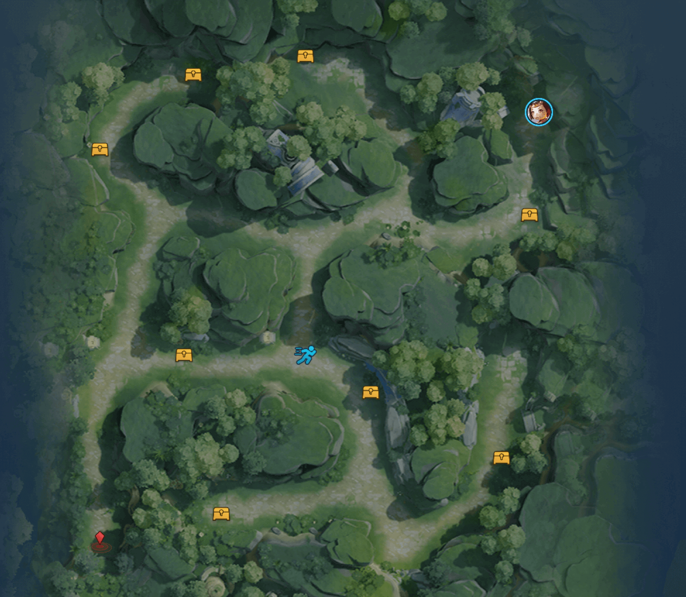
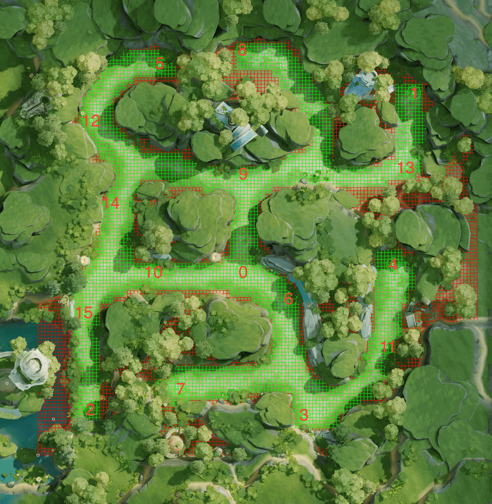
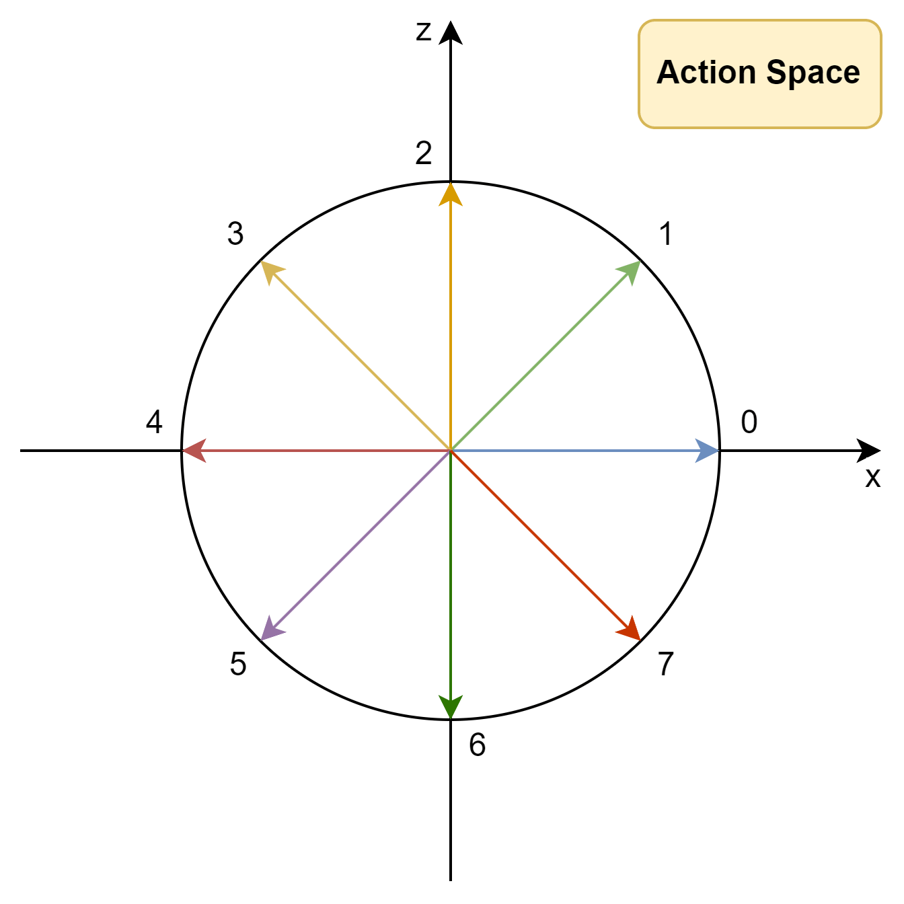
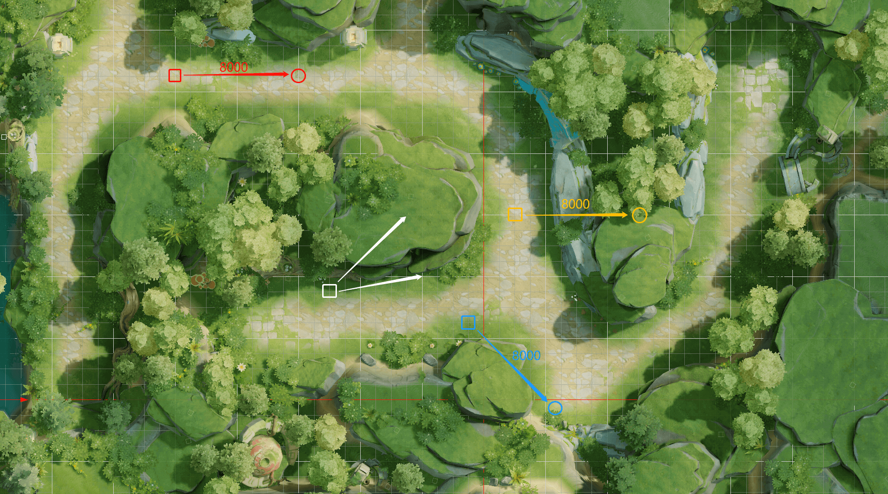
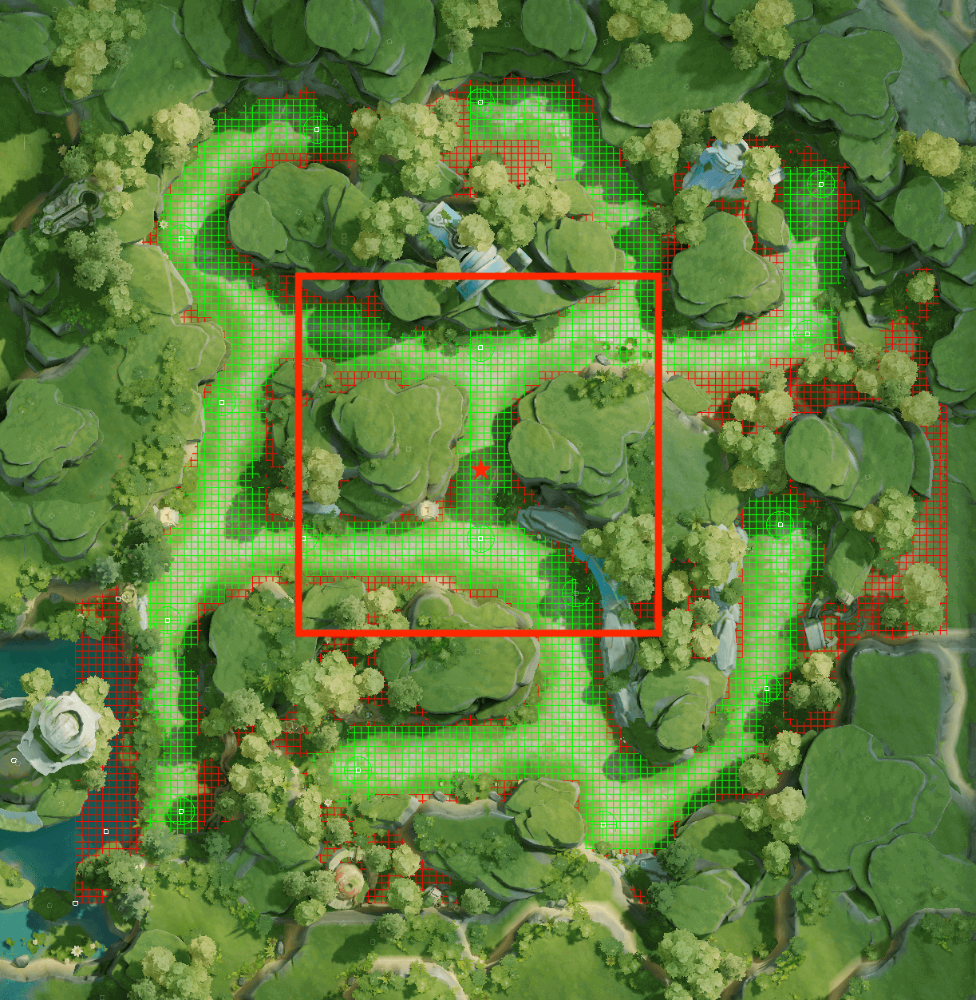

# 简介

## 任务介绍

重返秘境的目标是：训练一个智能体，让其在对地图不断的探索中学习移动策略，减少碰撞障碍物，以最少的步数**从起点走到终点**，并尽可能多的**收集宝箱**。

## 场景介绍



### 元素介绍

重返秘境地图中包含**英雄**、**起点**、**终点**、**道路**、**障碍物**、**宝箱**和**加速增益**，智能体在地图中没有全局视角。

| 元素 | 说明 |
| --- | --- |
| **英雄** | 环境中存在英雄单位，智能体可以控制英雄在地图中进行移动。本环境采用鲁班作为英雄角色。 |
| **起点** | 任务开始时，英雄单位在起点出现。 |
| **终点** | 任务设置的目的地，当英雄抵达终点时，任务结束。 |
| **道路** | 英雄在道路中有8个移动方向，智能体在执行一个动作后，英雄会朝该动作表示方向**持续移动3帧（1个step）**，然后在原地等待下一次动作指令。 |
| **障碍物** | 障碍物会阻挡英雄前进，当英雄在移动过程中遇到障碍物时，将紧贴障碍物边缘移动。有关智能体移动的详细介绍，请查看[移动、技能及执行逻辑](#执行逻辑)。 |
| **宝箱** | 如果用户给任务配置了宝箱，则智能体可以通过控制英雄拾取宝箱增加积分，每个宝箱获得100积分，地图中共有13个可配置宝箱的点位。可以通过配置宝箱的 **数量** 和 **随机性** 来调整环境的复杂度。 |
| **加速增益** | 在重返秘境地图中心存在一个加速增益，智能体可以通过拾取加速增益来提升自身的移动速度。在拾取加速增益后，移动速度提升 **40%**，持续 **10秒（约50个Step）**。在增益结束后，智能体恢复默认速度。加速增益被拾取后会在 **90秒（约454个Step）** 后重新出现。 |

在创建训练任务和评估任务时，上述元素的配置方式有所不同。具体请查看[开发指南-环境配置](#环境配置)部分。

关于步（step），帧（frame），时间秒（second）的换算关系请查看[开发指南-时间信息](#时间信息)。

---

### 视野域

在重返秘境环境中，智能体只有局部视野：以英雄所在位置为中心，分别向"上、下、左、右"四个方向拓宽 **25** 格数的一个正方形观察域（size=51x51）。

有关视野域的详细信息，请查看[开发指南-观测视野范围](#观测视野范围)。

### 技能

智能体有 **超级闪现** 技能，使用该技能可以使智能体向指定方向位移8000。技能冷却时间 **120秒(约606个Step)**。

> 💡 当智能体使用超级闪现时，如果闪现的目的地在障碍物内（不在可移动的道路范围内），本次闪现技能会将英雄移动到距离目的地最近的可移动位置上。

---

### 计分规则

每局任务开始前，用户可以设定最大步数，如果智能体在最大步数内（包括最大步数）成功抵达终点，则判定任务成功，并按下方规则计算任务得分：

任务得分 = 终点得分 + 步数得分 + 宝箱得分

- **终点得分**：到达终点即获得**150**分。
- **步数得分**：(最大步数 - 完成步数) * 奖励系数0.2，完成步数是智能体抵达终点所用的步数。
- **宝箱得分**：每获得一个宝箱，即可增加**100**分。

注意：若在**最大步数**内没有走到终点，则判定为任务超时。**超时任务的得分为0**。

# 环境介绍

> 💡 腾讯开悟提供了标准的强化学习开发流程，在正式进入开发之前，请先了解并熟悉[强化学习开发流程](#强化学习开发流程)。

## 强化学习环境

### 环境配置

在智能体和环境的交互中，首先会调用`env.reset`方法，该方法接受一个`usr_conf`参数，这个参数通过读取`conf/train_env_conf.toml`文件的内容来实现定制化的环境配置。因此，用户可以通过修改`conf/train_env_conf.toml`文件中的内容来调整环境配置。

```python
# usr_conf为用户传入的环境配置
observation, state = env.reset(usr_conf=usr_conf)
```

重返秘境环境支持配置的内容有：

| 数据名 | 数据类型 | 数据描述 |
| --- | --- | --- |
| **start** | int | 起点编号，范围是1~15，起点和终点不能重复 |
| **end** | int | 终点编号, 范围是1~15，起点和终点不能重复 |
| **treasure_random** | int | 是否生成随机宝箱，设置为1表示随机宝箱，设置为0表示固定宝箱，其他值非法 |
| **treasure_count** | int | 生成随机宝箱时的宝箱数量，仅在treasure_random=1时生效，范围是 0~ 13 |
| **treasure_id** | list of int | 生成固定宝箱时的宝箱编号，仅在treasure_random=0时生效，范围是 1~15，需要排除起点和终点编号，如果需要固定生成0个宝箱则传入[ ] |
| **max_step** | int | 单局最大步数，默认值为2000，无特殊需求不建议设置，过大的值会导致训练缓慢 |
| **talent_type** | int | 智能体技能，默认值为1，其他值非法 |

> **💡 补充说明**：
> 1. **环境配置仅在训练时生效**，请按上表所述进行`train_env_conf.toml`文件的配置。若配置错误，`env.reset`会在调用超时后返回None，无法获取任务状态，训练不会正常进行，您可以通过监控界面查看**错误日志**进行排查。
> 2. 有效的位置编号范围为1~15，因0号位置固定为加速增益的生成位置，1-15号位置可以配置起点/终点/宝箱。**随机生成**宝箱也是从有效位置编号中随机不重复的抽取。
> 3. 模型评估时，用户需要通过开悟平台创建评估任务并完成任务的环境配置，其中起点、终点位置固定为2和1，用户可以设置宝箱是否随机以及宝箱的数量。若设置为固定宝箱，则宝箱位置id从3开始按顺序生成，例如配置固定宝箱个数为5，则宝箱位置id为[3, 4, 5, 6, 7]。
> 4. `train_env_conf`采用的默认配置：

```toml
[env_conf]
# 整型，取值范围为1~15，默认值为2。
# 起点编号和终点编号不能重复。
# 起点编号
start = 2

# 整型，取值范围为1~15，默认值为1。
# 起点编号和终点编号不能重复。
# 终点编号
end = 1

# 布尔值，false - 固定宝箱，true - 随机宝箱
# 若开启固定，则使用treasure_id生成固定宝箱。
# 若开启随机，则使用treasure_count随机生成宝箱。
# 宝箱是否随机
# 默认值为true。
treasure_random = true

# 整型，生成随机宝箱时的宝箱数量，仅在treasure_random = true时生效，取值范围为0~13，默认值为8。
treasure_count = 8

# 生成固定宝箱时的宝箱编号，仅在treasure_random = false时生效，数组，取值范围为1~15，默认值为[]。
# 注意需要排除起点和终点编号，如果需要固定生成0个宝箱则传入[]。
treasure_id = []

# 整型，默认值为1，1表示超级闪现技能，其他值非法。
# 英雄技能
talent_type = 1

# 整型，取值范围1~2000, 默认2000
# 最大步数
max_step = 2000
```

每个位置id对应的位置如下图所示：



---

### 环境信息

在调用`env.reset`与`env.step`接口时，会返回环境当前的状态，如下所示。

```python
# usr_conf为用户传入的环境配置
observation, state = env.reset(usr_conf=usr_conf)
# step返回的`frame_no`是任务帧数，`terminated`表示任务结束，`truncated`表示任务中断(超时或异常)
frame_no, observation, score, terminated, truncated, state = env.step(act)
```

下面会将这些数据进行描述，具体细节可以参考[数据协议](#数据协议)：

#### 环境返回信息

| 数据名 | 数据类型 | 数据描述 |
| --- | --- | --- |
| frame_no | int32 | 当前帧数 |
| observation | Observation | 环境状态信息(观测信息) |
| score | ScoreInfo | 得分信息 |
| terminated | int32 | 表示游戏结束，即走到终点 |
| truncated | int32 | 表示任务中断（超时或异常） |
| state | State | 其他环境信息 |

用户调用`env.reset`可以返回环境的第一帧的状态，但仅包含观测空间obs。

#### 环境局部观测

`observation`包含环境返回的原始数据`frame_state`、环境的其他数据`game_info`、当前的合法动作`legal_act`以及环境的局部地图信息`map_info`。

以下是从环境中获取到的原始数据observation描述：

| 数据名 | 数据类型 | 数据描述 |
| --- | --- | --- |
| frame_state | FrameState | 环境帧数据 |
| game_info | GameInfo | 环境信息 |
| map_info | MapInfo | 地图信息 |
| legal_act | list of int | 合法动作 |

其中`MapInfo`的具体描述参考下表：

| 数据名 | 数据类型 | 数据描述 |
| --- | --- | --- |
| values | list of int | 地图信息行信息 |

#### 环境全局状态

`state`包含环境返回的全局信息。在本环境中，状态`state`与观测`observation`是相同的。为了提高训练效率，我们将state设定为空，以避免不必要的数据传递。

---

### 动作空间

重返秘境的动作空间分为两个部分：**移动**和**技能**，总的**Action维度为16**。env.step()传入的参数取值范围是0~15

#### 移动

**移动**使用的是8维离散化的动作空间，如下图所示，将360度等分为8份，每45度角一个动作方向，以x轴正方向为起点，逆时针旋转。



对应关系如下：

```python
// 方向角，以x轴正方向为起始边
enum Direction {
    Angle_0 = 0;
    Angle_45 = 1;
    Angle_90 = 2;
    Angle_135 = 3;
    Angle_180 = 4;
    Angle_225 = 5;
    Angle_270 = 6;
    Angle_315 = 7;
}
```

我们将移动用一个8维的one-hot vector来表征，比如Direction = Angle_90时，Action[0 : 8] = [0, 0, 1, 0, 0, 0, 0, 0]

#### 技能

智能体有 **超级闪现** 技能，技能默认CD为120秒，闪现距离为8000，超级闪现的方向和移动方向一致。技能同样也是用一个8维的one-hot vector来表征，比如使用超级闪现且超级闪现方向Direction = Angle_270时，Action[8 : 16] = [0, 0, 0, 0, 0, 0, 1, 0]。

#### 执行逻辑

接下来介绍智能体移动和技能的执行逻辑。在一次决策中，首先必须给智能体提供一个方向（8维的Direction），然后：

- 如果智能体执行**移动**动作，那么智能体会沿着该方向移动，一次预测（3帧）的移动距离大概为700，加速状态为1000。
  - 移动方向上无障碍物：正常移动。
  - 移动方向上有障碍物：如下图白色箭头，移动方向的命令为Angle_45=1, 实际执行时由于障碍物的阻挡，会沿着下方的白色箭头贴着障碍物的边缘移动。
- 如果智能体执行**超级闪现**动作，那么智能体会沿着该方向闪现，闪现距离为8000。
  - 闪现方向上无障碍物：正常闪现，如下图的红色箭头。
  - 闪现方向上有障碍物：智能体会出现在距离闪现目标位置最近的可移动区域内。
    - 下图中的白色和黄色箭头给出了可能的几种情况



> 💡 补充说明：
> - 正方形图标代表智能体所在位置，圆形图标代表目标位置，箭头方向代表动作方向
> - 地图中的网格是辅助线网格，一个白色网格的大小为1000x1000

#### 合法动作

在环境中的某一时刻，不是所有的动作都可以被执行，因此我们需要向模型输入legal action，将网络结果进行掩码（masking）从而避免不符合规则的动作被输出。

在重返秘境中，超级闪现作为一个可执行的动作在冷却未结束时需要被避免使用，因此，在我们默认设置里将超级闪现是否可使用的信息作为legal action输入。

在默认设置里，legal_action的输入为二维，第一维代表移动方向，第二维代表超级闪现方向。在超级闪现可以使用的时候移动和超级闪现都被允许预测，因此我们返还 [1, 1]， 在超级闪现冷却时超级闪现不被允许输出，因此我们返还[1, 0]。在DQN算法的网络中输出16维的Q值信息，前八维对应八个可行走方向，后八维对应八个可超级闪现方向，第一维legal_action对应前八维输出，第二维legal_action对应后八维输出。

### 得分信息

`env.step(act)` 返回的 `score` 是在当前状态下执行动作 `act` 智能体所获得的分数，分数的计算详见[计分规则](#计分规则)。

> **注意**：得分是用于衡量模型在环境中的表现，也作为衡量强化学习训练后的模型的优劣，与强化学习里的奖励要区别开。

---

### 环境监控信息

监控面板中包含了**env**模块，表示**环境指标**数据，详细说明如下。

| 指标名称 | 说明 |
| --- | --- |
| **score** | 该面板包含两个指标：<br> total_score：任务结束时的总积分，若任务超时，则该局积分为0。<br>treasure_score：任务结束时收集到的宝箱奖励。 |
| **steps** | 该面板包含两个指标：<br> max_steps：任务设置的最大步数。<br> finished_steps：任务结束时所用的步数。若任务超时，则该局完成步数等于最大步数。 |
| **treasure** | 该面板包含两个指标：<br> total_treasures：任务设置的宝箱个数。<br> collected_treasures：任务结束时收集到的宝箱个数。 |
| **treasure_random** | 宝箱是否随机。若为0则表示宝箱位置固定，若为1则表示宝箱位置随机。 |
| **buff_cnt** | 任务结束时收集到的加速增益数量。 |
| **skill_cnt** | 任务结束时使用闪现技能的次数。 |

---

### 时间信息

帧（frame）和步（step）存在一定映射关系。

**帧**是场景的一个时间单位，表示场景的一个完整更新周期。在每一帧中，场景的所有元素（如宝箱等）都会根据当前的状态和输入进行更新。

**步**是强化学习环境中的一个时间单位，表示智能体（agent）在环境中执行一个动作并接收反馈的过程。在每一步中，智能体选择一个动作，环境根据该动作更新状态，并返回新的状态、奖励和终止信号。

在本环境中，1个step由3个frame组成。这意味着每个动作对应一个步，在每一步中，智能体将在三个连续的帧中执行同一个动作。环境将在每一步结束后更新状态并返回反馈，场景只有在完成三帧后，环境状态才会返回一次状态的更新。

- **步更新**：在每一步中，智能体选择一个动作，环境更新状态并返回。
- **帧更新**：在一步中，场景进行三次帧更新，更新所有场景中对象的状态并渲染新的画面。

帧（frame），步（step），现实时间秒（s）和现实时间毫秒（ms）的关系如下：

1 frame 约等于 66 ms

1 step 等于 3 frame

1 s 等于 1000 ms

> **注意** ：由于运行环境的差异，每一帧的时间会在66毫秒上下浮动

---

## 强化学习智能体

### 特征处理

#### 观测视野范围

智能体观测到的地图范围是有限的，我们在观测空间中提供了智能体的视野域信息，即英雄周围的网格化后的局部信息。如下图所示：



> 💡 补充说明：
> - 上图中的"圆形"代表的是物件（终点、宝箱、加速增益）的触发范围。（圆形通常在每条道路的尽头，请仔细观察地图。）
> - 局部地图信息维度较大，更适合先用CNN进行图片的特征提取。
> - 上图中的网格就是特征工程里对地图的网格化处理，网格的宽度为500，将64000x64000的地图划分成了128x128的网格，基于网格生成了很多特征（比如grid_distance，4个map特征）。有关特征工程的详细代码说明请查看[代码包介绍-实现特征处理和样本处理](#实现特征处理和样本处理)。

#### 特征预处理

环境返回的`observation`信息包含了当前环境的局部观测信息，在代码包中，我们提供了特征处理函数`observation_process`对这些局部观测信息进行特征处理。在特征处理函数`observation_process`中，我们提供了预处理器`preprocessor`对环境返回的`observation`信息进行预处理，预处理后的信息参考以下这些数据的描述：

| 数据名 | 数据类型 | 数据描述 |
| --- | --- | --- |
| norm_pos | FloatPosition | 归一化后的绝对坐标 |
| grid_pos | Position | 网格坐标 |
| start_pos | RelativePosition | 起点的相对位置 |
| end_pos | RelativePosition | 终点的相对位置 |
| buff_pos | list of RelativePosition | 加速增益的相对位置 |
| treasure_pos | RelativePosition | 宝箱的相对位置 |
| obstacle_map | list of int | 周边障碍物信息 |
| memory_map | list of int | 周边记忆地图信息 |
| treasure_map | list of int | 周边宝箱信息 |
| end_map | list of int | 周边终点信息 |
| legal_act | list of int | 环境当前状态的可执行的动作 |

#### 位置信息

以norm_pos和grid_pos为例，分别表示归一化后的绝对坐标和网格坐标，分别为FloatPosition类型和Position类型，norm_pos由grid_pos计算得到

```python
# FloatPosition的协议描述
message FloatPosition {
  float x = 1;                // x坐标
  float z = 2;                // z坐标
}
# Position的协议描述
message Position {
  int32 x = 1;                // x坐标
  int32 z = 2;                // z坐标
}
# 示例代码
pos = Position(x=100, z=100)
float_pos = FloatPosition(
        x=pos.x/64000,
        z=pos.z/64000,
    )
```

#### 相对位置信息

下面是对`RelativePosition`详细的描述：

`RelativePosition`表征的是英雄在任意位置时，物件的相对位置信息，比如方向，距离。其中：

- `RelativeDirection`通过枚举离散化表示方向信息。`RELATIVE_DIRECTION_NONE` `East` `NorthEast` `North` `NorthWest` `West` `SouthWest` `South` `SouthEast` 
- `RelativeDistance`通过枚举离散化表示距离信息。`RELATIVE_DISTANCE_NONE` `VerySmall` `Small` `Medium` `Large` `VeryLarge`
- **path_distance**和**grid_distance**是通过将地图网格化后计算出的从英雄当前格子到目标格子的网格路径最短距离，前者进行了离散化处理，后者进行了归一化处理。

| RelativePosition | 数据类型 | 数据描述 |
| --- | --- | --- |
| direction | RelativeDirection | 相对方位（离散化） |
| l2_distance | RelativeDistance | L2距离（离散化） |
| path_distance | RelativeDistance | 网格化后的最短路径距离（离散化） |
| grid_distance | float | 网格化后的最短路径距离（归一化） |

> 💡 **特别说明**：
> - 在计算两点的grid_distance时，如果有一点的位置在障碍物里（无法走到的点位），grid_distance统一设置为1。因此，在解包时如果发现智能体距离宝箱或加速增益的grid_distance为1，说明宝箱和buff不存在或已被收集。
> - grid_distance的计算是对同学们隐藏了的，以观测的方式直接从环境中返回，grid_distance表征的是智能体当前位置与某个物件的最短路径距离，该路径距离指的是网格路径。具体做法是先得到智能体和物件的网格坐标，然后通过bfs搜索算法按照L1距离的方式来计算出两个网格相距的最短路径。比如[1, 4]和[5, 10]的最短网格距离为| 1 - 5 | + | 4 - 10 | = 4 + 6 = 10。最后将该距离除以256来归一化，即10 / 256 = 0.039。
> - 由于grid_distance在做归一化计算时是将所有距离除以256，因此在进行逆归一化时要乘以256从而得到原始的整形的grid_distance。

#### 合法动作

环境的当前状态状态包括当前的合法动作（即当前状态下哪些动作可以被执行），如智能体的技能还在冷却中，则该技能的legal_act会被标记为0，具体详见[动作空间-合法动作](#合法动作)。

### 其他环境信息

其他环境信息包括：积分信息，环境是否结束信息，环境是否异常结束，环境当前状态信息，分别在`score`、`terminated`、`truncated`、`env_info`中体现。其中`env_info`

中包含了丰富的环境状态信息，用户可以使用这些信息进行特征工程等工作，具体可以参考[数据协议](#数据协议)。

环境信息的某些细节代码对同学们进行了隐藏，下面是通过文档的方式对其中调用的几个重要函数进行简单的介绍。其中比较重要的是`convert_pos_to_grid_pos`函数，这个函数是将原始数据中的坐标转换为128x128的栅格化后坐标。

- `norm(pos):`
  - **Introduction**: 坐标归一化
  - **Parameters**
    - `pos:` 坐标位置
  - **Realization**
    ```python
    float_pos = FloatPosition(
            x=pos.x/64000,
            z=pos.z/64000,
        )
    ```
- `polar_norm(pos):`
  - **Introduction**: 转换极坐标并归一化
  - **Parameters**
    - `pos:` 坐标位置
  - **Realization**
    ```python
    r = math.hypot(pos.x, pos.z) / (64000*math.sqrt(2))
      theta = math.atan2(pos.z, pos.x)
      if theta < 0:
          theta = 2 * math.pi + theta
      theta = theta / (math.pi * 2)
    
      float_pos = FloatPosition(
          x=r,
          z=theta
      )
    ```
- `ln_distance(a1, b1, a2, b2, n):`
  - **Introduction**: 计算 l_n距离
  - **Parameters**
    - `a1:` 当前位置x坐标
    - `b1:` 当前位置z坐标
    - `a2:` 目标位置x坐标
    - `b2:` 目标位置z坐标
    - `n:` 指数值
- `get_relative_pos():`
  - **Introduction**: 获得 organ（宝箱和buff）相对当前位置的方向和距离信息
  - **Realization**
    ```text
    x, z = convert_pos_to_grid_pos(pos.x, pos.z)
    info = REL_POS[str(id)][str((x, z))]
    rel_pos = RelativePosition()
    rel_pos.direction = info["direction"]
    rel_pos.l2_distance = info["l2_distance"]
    rel_pos.path_distance = info["path_distance"]
    rel_pos.grid_distance = info["grid_distance"]
    ```
- `get_null_relative_pos():`
  - **Introduction**: 返还空的 RelativePosition, 当宝箱不存在或被获取后调用
  - **Realization**
    ```python
    rel_pos = RelativePosition()
    rel_pos.direction = RelativeDirection.RELATIVE_DIRECTION_NONE
    rel_pos.l2_distance = RelativeDistance.VeryLarge
    rel_pos.path_distance = RelativeDistance.VeryLarge
    rel_pos.grid_distance = 1
    ```
- `convert_pos_to_grid_pos(x, z):`
  - **Introduction**: 将pos转换为珊格化后坐标，网格的左下角顶点为原点，对应的game core坐标为(-2250, -5250)
  - **Parameters**
    - `x:` 当前位置x坐标
    - `z:` 当前位置z坐标
  - **Realization**
    ```python
    x = (x + 2250) // 500
    z = (z + 5250) // 500
    ```
- `get_feature(pos, memory_map, map_data, organs):`
  - **Introduction**: 整理所有的特征信息
  - **Parameters**
    - `pos:` 当前位置
    - `memory_map:` 上一次行动的memory_map
    - `map_data:` 本次任务栅格化地图信息
    - `organs:` list of organs
  - **Realization**
    ```python
    # 对宝箱和buff进行相对位置和距离的计算
    for organ in organs:
        if organ.sub_type == 2:
            # Buff
            if organ.status == 1:
                # 可取
                buff_pos = get_relative_pos(pos, organ.config_id)
            else:
                # 不可取
                buff_pos = get_null_relative_pos()
        elif organ.sub_type == 1:
            # treasure
            if organ.status == 1:
                # 可取
                treasure_poss[organ.config_id - 
                          1] = get_relative_pos(pos, organ.config_id)
                treasure_grids.add(convert_pos_to_grid_pos(*POS_POOL[f'map_{GW2_CONFIG.map_id}'][str(organ.config_id)]))          
        grid_pos_x, grid_pos_z = convert_pos_to_grid_pos(pos.x, pos.z)
    
    # Memory map 需要在local_memory_map初始化后更新  
    memory_map[grid_pos_x, grid_pos_z] = min(1, 0.2 + memory_map[grid_pos_x, grid_pos_z])
    ```

---

### 算法介绍

我们在重返秘境代码包中提供了2个核心算法 **DQN**，**Target-DQN**，同时，我们还提供了一个**diy**模板算法文件夹，用户可在该文件夹中自定义算法实现。

#### DQN 算法

DQN算法将Q-Learning与深度神经网络结合，用神经网络拟合Q值函数，解决高维状态空间问题。引入经验回放（存储历史样本）提升稳定性。DQN可以处理高维输入，适应复杂环境。但训练不稳定，稳定性不高，需大量调参。

#### ​Target-DQN 算法

DQN改进版，分离目标网络（计算目标Q值）和策略网络（选择动作），缓解Q值过估计问题，Target网络实现简单，可有效提高DQN算法的稳定性。

---

### 算法监控信息

监控面板中包含了**algorithm**模块，展示**算法指标**数据，以下是本环境中提供的DQN算法和Target-DQN算法指标的详细说明。

| 指标名称 | 说明 |
| --- | --- |
| **reward** | 累积回报，反应了智能体的能力，正常训练情况下指标应该是震荡向上。 |
| **q_value** | 目标网络的Q值，一定程度反应Q值的稳定性。 |
| **value_loss** | 计算loss的标量值，反应训练的进程，正常情况下指标应该是逐渐接近于0。 |

---

### 模型保存限制策略

为了避免用户保存模型的频率过于频繁，开悟平台对模型保存会有安全限制，不同的任务会有不同的限制，限制规则详情如下：

- 保存模型的频率限制: 2次/分钟
- 单个任务保存模型的次数限制：（不同算法的限制不同）
  - DQN or Target-DQN：100次
  - DIY：100次

---

### 模型评估模式

在重返秘境中，评估时用户需要在提交任务界面进行宝箱配置，具体配置如下：

```
# 默认值
宝箱数量：13
宝箱是否随机：否
最大步数：1000
```

另外，训练模式时，用户一般使用agent.predict方法进行决策；而在评估模式时，平台会调用agent.exploit方法进行决策，一般情况下，模型在训练和评估时的决策会因算法不同和用户设计不同，而有不同的行为，这部分由用户定义和实现。

---

# 强化学习开发流程介绍

## 简介

在腾讯开悟平台中，一个训练任务的流程如下图所示：


训练任务中包含环境和智能体两大要素，智能体包含一个可被训练的模型，智能体可以对环境给出的观测进行决策，这个决策作用于环境产生新的观测，此过程通过训练工作流控制，不断循环。

另一方面，训练工作流还要收集循环过程中产生的每一帧数据，将他们组合成样本数据，智能体可以将这些样本数据作为算法的输入，通过算法更新模型参数。

如果采用分布式训练，会启动多个容器，此时样本数据需要通过网络通信发送到训练容器（learner）中进行训练，所以要对样本数据进行编码以方便网络发送，同时智能体需要将learner容器上的模型通过网络同步回来。

腾讯开悟提供了标准的强化学习开发流程，帮助用户快速完成相关内容的开发。

**开发流程简介**

为保证训练任务正常进行，我们需要完成以下几部分的开发：

1. [定义数据结构](#定义数据结构)：一般情况下，环境产生的原始观测数据不能直接作为智能体的输入，并且不同的用户开发的智能体一般是不一样的，显然不同的智能体的决策、学习方法的输入输出也是不一样的，所以开发的第一步，我们应该定义智能体输入输出的数据结构。包括特征（ObsData）、动作（ActData）、样本（SampleData），其中`ObsData`和`ActData`分别作为智能体`predict`方法的输入和输出，`SampleData`作为智能体`learn`方法的输入。
2. [实现特征处理和样本处理](#实现特征处理和样本处理)：不同的用户实现不同的智能体可能会定义不同的数据结构，但是，环境接口输入输出的数据结构是固定的，因此环境接口的输入输出数据和智能体接口的输入输出数据需要进行转换，所以还需要用户实现这些数据结构的转换方法。包括：`observation_process`, `action_process`, `sample_process`。
3. [算法开发](#算法开发)：用户需要实现一个 agent，agent中需要实现模型（一般是神经网络模型）和算法（强化学习算法）。agent负责与环境交互，产生预测动作并训练模型。
4. [实现强化学习训练工作流](#强化学习训练工作流开发)：在实现了 `数据结构`，`数据处理函数`，`模型`和 `智能体` 以及其他方法（如奖励处理函数）后，我们还需要实现一个强化学习的**训练工作流**`workflow`，将所有组件组合起来完成强化学习训练，即智能体通过不断的与环境交互，获取样本数据，更新并迭代模型，直到模型收敛到我们想要的效果。另外，用户可以对训练参数进行配置，在分布式训练时，开悟平台会启动一个样本池，一个模型同步服务，这些组件的相关参数用户也可以根据自己的需求进行配置。


**分布式训练**

在腾讯开悟平台，训练任务的运行分为单机和分布式，单机指的是训练涉及的所有组件(进程)都在一个计算节点上运行，分布式指的是训练涉及的所有组件(进程)会分布在不止一个计算节点上运行，节点之间通过网络组件进行通信，配合完成任务。

如果选择分布式训练模式，开悟平台会启动一个样本池（样本先进先出），用户的agent.learn(samples)调用将会把样本发送到样本池，训练容器会从样本池中采样样本samples将其传入agent.learn(samples)进行训练，此过程是自动的，用户无需开发额外代码。

由于sample的类型是用户定义的 `SampleData`，该类型无法直接进行网络传输，需要统一编码成 `Numpy.array`类型的数据。所以需要用户编写 `SampleData2NumpyData`函数实现 `SampleData`类型数据到 `Numpy.array`类型的转换，同时还要编写 `NumpyData2SampleData`函数实现 `Numpy.array`类型数据到 `SampleData`类型的转换，两个函数作为相对应的编码和解码函数，每一位数据都需要对齐，否则将产生数据错误，无法有效训练。

另外，由于模型在训练容器（learner）进行训练，用户需要按需在恰当时机从训练容器加载模型。开悟平台会在某个容器中启动一个模型同步服务，用户在`workflow`中调用agent.load_model(id="latest")将会加载最新模型，若希望加载中间模型则可以指定id，若希望加载随机模型则调用agent.load_model(id="random")。

最后，是用户可以配置的参数。根据SampleData转换成的Numpy.array的数据长度设置`<agent_算法名称>/conf/conf.py`中配置项`SAMPLE_DIM`的值。还有样本池和模型同步服务的参数。

分布式训练架构如下图：


---

接下来，我们将详细介绍开发流程中每一个模块的实现逻辑和核心函数。

## 开发流程

首先，我们先简单了解下完整的代码包目录，后续的开发工作将在不同的文件中进行。

完整的代码包目录结构如下：

| 目录名 | 介绍 |
| --- | --- |
| **<agent_算法名称>** | 算法子目录，用户的大部分代码开发在这个目录中，一般一个代码包中会包含多个算法子目录 |
| **diy** | Do it yourself 用户自定义算法的子目录 |
| **conf** | 配置文件 |
| **train_test.py** | 代码正确性测试脚本 |

### 代码包目录介绍

各个算法的子目录结构如下：

| 目录/文件名 | 介绍 |
| --- | --- |
| **algorithm/** | 算法相关，主要是 算法 的实现，可以实现多个算法，详情见[算法开发](#算法开发) |
| **feature/** | 特征相关，主要包含用户自定义的数据结构和数据处理方法，以及特征和奖励的计算，详情见[实现特征处理和样本处理](#实现特征处理和样本处理) |
| **model/** | 模型相关，主要是模型的实现，是一个Model类 |
| **conf/** | 配置，用户可以增加配置或修改配置 |
| **agent.py** | 智能体相关，主要是 agent 的实现，包含预测等，详情见[智能体开发](#智能体开发) |
| **workflow/** | 强化学习的训练流程，详情见[强化学习训练工作流开发](#强化学习训练工作流开发) |

---

### 智能体开发

#### 定义数据结构

环境返回的原始观测信息 `obs`的数据结构可以参考协议，这里的 `obs` 已经做了一定的**数据预处理**工作，但是智能体是由用户设计和实现的，环境使用的`obs`, `act`等与智能体的输入输出是存在差异的，所以要先定义数据结构（类）再进行数据转换，包括：包括特征（ObsData）、动作（ActData）、样本（SampleData），这部分的代码，都需要实现在`<agent_算法名称>/feature/definition.py`中。

首先需要定义相关的数据结构（类）包含观测数据ObsData，动作数据ActData，和样本数据SampleData, 其中：

- ObsData和ActData分别表示智能体预测的输入和输出，将会由agent.predict使用；
- SampleData为样本的数据类型，样本数据将会被agent.learn中的代码进行处理用于模型的训练。

在`definition.py`文件中通过`create_cls`函数创建数据结构（类）。`create_cls`的第一个参数为类型名称，剩余参数为类的属性，属性默认值为None。这些数据结构（类）包含哪些属性完全由用户自定义，属性名称和属性数量没有限制。

**核心函数介绍**

##### `create_cls`

- **Introduction**: 用于动态创建一个类，这个类包含哪些属性完全由用户自定义，属性名称和属性数量没有限制
- **Parameters**:
  - `第一个参数`: 字符串类型，表示为定义类型的名称
  - `其余参数`: 定义类的属性名称，属性默认值为None

示例代码：

```python
# The create_cls function is used to dynamically create a class. The first parameter of the function is the type name,
# and the remaining parameters are the attributes of the class, which should have a default value of None.
# create_cls函数用于动态创建一个类，函数第一个参数为类型名称，剩余参数为类的属性，属性默认值应设为None
ObsData = create_cls("ObsData", 
    feature=None, 
)
ActData = create_cls("ActData", 
    action=None, 
)
SampleData = create_cls("SampleData", 
    state=None, 
)
```

> **注意**：必须使用`create_cls`这个函数创建这些类，若使用普通的类定义方法（class 类名）将无法在开悟平台正确运行。

---

#### 实现特征处理和样本处理

用户需要实现特征处理，动作处理，样本处理，和奖励设计函数，例如环境返回的数据属于原始观测数据，是无法直接作为智能体预测时的输入的，我们需要实现特征处理函数`observation_process`，将环境返回的原始观测数据转换成用户定义的ObsData。这部分的代码，都需要实现在`<agent_算法名称>/feature/definition.py`中。

需要实现特征处理和样本处理的函数有：`observation_process`, `action_process`, `sample_process`。

> **注意**：这三个函数都必须使用@attached装饰器，代码默认已实现，注意不要删除。@attached装饰器会将用户实现的函数注册到开悟框架，若未使用装饰器，训练无法正常进行。

**核心函数介绍**

##### `observation_process`

- **Introduction**: 将环境返回的原始观测数据转换成用户定义的ObsData类型数据
- **Parameters**:
  - `obs`: Observation类型，env.reset和env.step返回的原始观测数据
  - `state`: EnvInfo类型，env.reset和env.step返回的环境状态数据
- **Return type**:
  - ObsData类型，用户定义的ObsData类型的数据 

示例代码：

```python
@attached
def observation_process(obs, state=None):
    return ObsData(feature=feature, legal_act=legal_actions)
```

##### `action_process`

- **Introduction**: 将智能体预测返回的ActData类的数据转换成env.step能处理的动作数据
- **Parameters**:
  - `act_data`: ActData类型，用户定义的ActData类型的数据
- **Return type**:
  - env.step能处理的动作数据类型 

示例代码：

```python
@attached
def action_process(act_data):
    return act_data.act
```

##### `sample_process`

- **Introduction**: 将环境数据帧的集合转换为样本的集合
- **Parameters**:
  - `list_game_data`: list(Frame) 类型，使用用户自定义的Frame作为输入，因为样本一般进行批处理，所以传入列表
- **Return type**:
  - list(SampleData)类型，SampleData类型的数据组成的列表

示例代码：

```python
@attached
def sample_process(list_game_data):
    return [SampleData(**i.__dict__) for i in list_game_data]
```

为了支持分布式训练，样本数据需要进行网络传输，由于SampleData无法直接进行网络传输，需要先转换成Numpy的Array，待传输到对端之后再由np.Array转换成SampleData。所以用户需要实现两个转换函数`SampleData2NumpyData`和`NumpyData2SampleData`，这两个函数互为反函数。以下是代码包中这两个函数的示例代码：

> **注意**：这两个函数的实现都必须包含一个装饰器@attached

##### `SampleData2NumpyData`

- **Introduction**: 将SampleData转换为NumpyData
- **Parameters**:
  - `g_data`: SampleData 类型
- **Return type**:
  - Numpy.array类型

示例代码：

```python
@attached
def SampleData2NumpyData(g_data):
    return g_data.npdata
```

##### `NumpyData2SampleData`

- **Introduction**: 将NumpyData转换为SampleData
- **Parameters**:
  - `s_data`: Numpy.array 类型
- **Return type**:
  - SampleData类型

示例代码：

```python
@attached
def NumpyData2SampleData(s_data):
    return SampleData(npdata=s_data)
```

---

#### 奖励设计

这里的奖励特指强化学习中的Reward，注意要与环境反馈的Score进行区分。Score用于衡量玩家在任务中的表现，也作为衡量强化学习训练后的模型的优劣。

代码包里提供了一些奖励的实现，可以参考`<agent_算法名称>/feature/definition.py`里的`reward_shaping`函数修改各个奖励的权重。用户还可以在这个函数中去实现自己的reward设计，这部分非常开放，回报设计的依据不一定只是环境给出的信息，也可以是用户对问题的理解、经验或者知识，建议用户根据对问题和强化学习算法的理解，去设计和实现自己的reward。

**核心函数介绍**

##### `reward_shaping`

- **Introduction**: 该方法用于实现用户设计的奖励方案。
- **Parameters**:
  - 参数个数和类型不限制，可以是环境信息、智能体信息、用户的经验和知识等。
- **Return type**:
  - 数值类型，根据用户设计的奖励方案，计算出的最终reward。

---

#### 算法开发

在代码包中，我们提供了不同的算法子目录，给用户进行算法的实现，每个算法的开发流程都是一致的，接下来我们描述如何实现：

首先，如果我们需要实现一个神经网络模型，我们需要在文件`<agent_算法名称>/model/model.py`中实现一个`Model`类，即用pytorch实现一个神经网络模型。

然后，我们需要在文件`<agent_算法名称>/agent.py`中实现一个 `Agent`类。注意`Agent`类需要继承 `kaiwu_agent.agent.base_agent` 的 `BaseAgent` 类，`Agent`类的实现需要符合`BaseAgent`类的接口规范。或者，如果在`<agent_算法名称>/algorithm/`文件夹下实现了算法，`Agent`类需要继承此算法类。

> **注意**：`Agent`类必须使用@attached装饰器，代码默认已实现，注意不要删除。

示例代码：

```python
class BaseAgent:
    """
    Agent 的基类，所有的 Agent 都应该继承自这个类"""
    def __init__(self, agent_type="player", device=None, logger=None, monitor=None) -> None:
        raise NotImplementedError

    def learn(self, list_sample_data) -> dict:
        """
        用于学习的函数，接受一个 SampleData 的列表
        """
        raise NotImplementedError

    def predict(self, list_obs_data: list) -> list:
        """
        用于获取动作的函数，接受一个 ObsData 的列表, 返回一个动作列表
        """
        raise NotImplementedError

    def exploit(self, list_obs_data: list) -> list:
        """
        用于获取动作的函数，接受一个 ObsData 的列表, 返回一个动作列表
        """
        raise NotImplementedError

    def save_model(self, path, id='1'):
        raise NotImplementedError

    def load_model(self, path, id='1'):
        raise NotImplementedError
```

**核心函数介绍**

##### `predict`

- **Introduction**: 该方法通过调用模型进行预测，是智能体训练时调用的方法，一般是依策略的概率分布采样或引入随机概率。
- **Parameters**:
  - `list_obs_data`: list(ObsData) 类型，使用用户自定义的ObsData作为输入进行预测，predict可进行批预测，所以传入ObsData的列表
- **Return type**:
  - list(ActData) 类型，预测结果是用户定义的ActData类型，predict可进行批预测，所以类型是list

示例代码：

```python
"""
<agent_算法名称>/agent.py
"""
@attached
class Agent(BaseAgent):
    @predict_wrapper
    def predict(self, list_obs_data):
        return self.__predict_detail(list_obs_data, exploit_flag=False)
```

##### `exploit`

- **Introduction**: 该方法也通过调用模型进行预测，是智能体在评估时调用的方法，一般是选取策略中概率最高的动作或者策略认为最优的动作。
- **Parameters**:
  - `list_obs_data`: list(ObsData) 类型，使用用户自定义的ObsData作为输入进行预测，exploit可进行批预测，所以传入ObsData的列表
- **Return type**:
  - list(ActData) 类型，预测结果是用户定义的ActData类型，exploit可进行批预测，所以类型是list

示例代码：

```python
"""
<agent_算法名称>/agent.py
"""
@attached
class Agent(BaseAgent):
    @exploit_wrapper
    def exploit(self, list_obs_data):
        return self.__predict_detail(list_obs_data, exploit_flag=True)
```

##### `learn`

- **Introduction**: 该方法主要负责消费样本进行模型训练，需要实现核心的强化学习算法。
- **Parameters**:
  - `list_sample_data`: list(SampleData) 类型，使用用户自定义的SampleData作为输入进行训练，一般进行批训练，所以传入SampleData的列表

示例代码：

```python
"""
<agent_算法名称>/agent.py
"""
@attached
class Agent(BaseAgent):
    @learn_wrapper
    def learn(self, list_sample_data):
        # 算法详细代码不在此处展示
        loss = policy_loss + Config.VALUE_LOSS_COEFF * value_loss
        loss.backward()
        grad_norm = torch.nn.utils.clip_grad_norm_(self.model.parameters(), 0.5)
        # Gradient Descent
        # 梯度下降
        self.optimizer.step()
```

##### `save_model`

- **Introduction**: 该方法主要负责模型的保存，注意模型默认的前缀model.ckpt-不要改动，可以通过id区分不同的模型。如果我们的模型是标准的pytorch格式，`save_model`方法中可以直接调用torch.save。
- **Parameters**:
  - `path`: 字符串类型，表示保存模型的路径 
  - `id`: 字符串类型，表示保存模型的唯一id

示例代码：

```python
"""
<agent_算法名称>/agent.py
"""
@attached
class Agent(BaseAgent):
    @save_model_wrapper
    def save_model(self, path=None, id="1"):
        # To save the model, it can consist of multiple files,
        # and it is important to ensure that each filename includes the "model.ckpt-id" field.
        # 保存模型, 可以是多个文件, 需要确保每个文件名里包括了model.ckpt-id字段
        model_file_path = f"{path}/model.ckpt-{str(id)}.pkl"

        # Copy the model's state dictionary to the CPU
        # 将模型的状态字典拷贝到CPU
        model_state_dict_cpu = {k: v.clone().cpu() for k, v in self.model.state_dict().items()}
        torch.save(model_state_dict_cpu, model_file_path)

        self.logger.info(f"save model {model_file_path} successfully")
```

##### `load_model`

- **Introduction**: 该方法主要负责模型的保存，注意模型默认的前缀model.ckpt-不要改动，可以通过id区分不同的模型。如果我们的模型是标准的pytorch格式，`load_model`方法中可以直接调用torch.load。
- **Parameters**:
  - `path`: 字符串类型，表示载入模型的路径
  - `id`: 字符串类型，表示载入模型的唯一id

示例代码：

```python
"""
<agent_算法名称>/agent.py
"""
@attached
class Agent(BaseAgent):
    @load_model_wrapper
    def load_model(self, path=None, id="1"):
        # When loading the model, you can load multiple files,
        # and it is important to ensure that each filename matches the one used during the save_model process.
        # 加载模型, 可以加载多个文件, 注意每个文件名需要和save_model时保持一致
        model_file_path = f"{path}/model.ckpt-{str(id)}.pkl"
        self.model.load_state_dict(
            torch.load(model_file_path, map_location=self.device),
        )

        self.logger.info(f"load model {model_file_path} successfully")
```

> **注意**：
> 1. `Agent`类的五个核心方法必须使用相应的装饰器，例如learn方法必须使用@learn_wrapper装饰器。代码默认已实现，注意不要删除。
> 2. 如果在本地训练DIY算法时，遇到电脑卡顿，CPU占用过多的情况，请在算法文件夹下的`agent.py`中通过以下代码调整线程数，推荐设置为1。
>
> ```python
> torch.set_num_threads(1)
> torch.set_num_interop_threads(1)
> ```

---

### 强化学习训练工作流开发

完成了上述开发步骤之后，需要再实现一个强化学习的训练工作流 - `workflow`，来让智能体 `Agent` 和环境 `Environment` 不断的交互从而产生训练样本并更新模型。腾讯开悟平台的强化学习训练工作流包含：

1. 获取env和agent
2. 监控数据初始化
3. 进入训练主循环
   1. 使用用户自定义的配置调用env.reset获得环境的第一帧
   2. 进入环境的episode循环
      1. 调用observation_process进行特征处理，得到ObsData类型的数据
      2. 调用agent.predict, 执行智能体决策，得到ActData类型的数据
      3. 调用action_process将上一步的ActData类型数据转换为env能处理的动作
      4. 调用env.step，执行动作与环境交互, 获取下一帧的状态
      5. 计算 reward
      6. 收集当前帧的所有信息
      7. 若episode结束或达到训练条件，调用sample_process处理当前收集到的所有信息并生成样本
      8. 若有样本生成则调用agent.learn进行训练
      9. 调用agent.load_model从模型同步服务更新最新模型
   3. 以适当时间上报适当的监控数据
4. 训练结束，保存最终模型


为了实现这个强化学习训练工作流，我们需要在文件`<agent_算法名称>/train_workflow.py`中实现一个 `workflow`方法。

**核心函数介绍**

#### `workflow`

- **Introduction**: 该函数实现强化学习训练工作流。
- **Parameters**:
  - `envs`: list类型，环境列表，开悟框架会通过调用开悟场景库，得到相应的环境, 并作为输入传入 `workflow`。
  - `agents`: list类型，智能体列表，通过调用用户实现的 `<agent_算法名称>/agent.py` 实例化 Agent, 并作为输入传入 `workflow`。
  - `logger`: Logger类型，开悟提供的日志组件，接口与常见的 `python` 的 `logging` 库一致。
  - `monitor`: Monitor类型，开悟提供的监控组件。

> **注意**：workflow函数需要装饰器@attached，该代码不能删除！

示例代码：

```python
"""
<agent_算法名称>/train_workflow.py
"""
@attached
def workflow(envs, agents, logger=None, monitor=None):
    env, agent = envs[0], agents[0]
    episode_num_every_epoch = 1

    for epoch in range(epoch_num):
        epoch_total_rew = 0
        data_length = 0
        for g_data in run_episodes(episode_num_every_epoch, env, agent, g_data_truncat, logger):
            data_length += len(g_data)
            total_rew = sum([i.rew for i in g_data])
            epoch_total_rew += total_rew
            agent.learn(g_data)
            g_data.clear()
```

下面是一个任务循环的实现，基本是开发者之前实现的各个组件的调用：

```python
# 任务循环
done = False
collector = list()
while not done:
    # Agent performs inference, gets the predicted action for the next frame
    # Agent 进行推理, 获取下一帧的预测动作
    act_data = agent.predict(list_obs_data=[obs_data])

    # Unpack ActData into action
    # ActData 解包成动作
    act = action_process(act_data)

    # Interact with the environment, execute actions, get the next state
    # 与环境交互, 执行动作, 获取下一步的状态
    frame_no, _obs, score, terminated, truncated, _state = env.step(act)
    if _obs == None:
        break

    step += 1

    # Feature processing
    # 特征处理
    _obs_data = observation_process(_obs, _state)

    # Disaster recovery
    # 容灾
    if truncated and frame_no == None:
        break

    # Calculate reward
    # 计算 reward
    reward = reward_shaping(
            frame_no,
            score,
            terminated,
            truncated,
            obs,
            _obs,
    )

    done = terminated or truncated

    # Construct frame
    # 构造游戏帧，为构造样本做准备
    frame = Frame(
        obs=obs_data.feature,
        _obs=_obs_data.feature,
        act=act,
        rew=reward,
        done=done,
    )

    collector.append(frame)

    # If the game is over, the sample is processed and sent to training
    # 如果游戏结束，则进行样本处理，将样本送去训练
    if done:
        if len(collector) > 0:
            collector = sample_process(collector)
            # 返回样本数据, agent会调用agent.learn(g_data)进行训练
            yield collector
        break

    # Status update
    # 状态更新
    obs_data = _obs_data
    obs = _obs
    state = _state
```

下面是监控功能的一个展示：

```python
@attached
def workflow(envs, agents, logger=None, monitor=None):
    # 此处省略一些代码
    last_report_monitor_time = 0
    monitor_data = dict()
    if monitor and monitor_data:
        now = time.time()
        if now - last_report_monitor_time >= 60:
            monitor.put_data({os.getpid(): monitor_data})
            last_report_monitor_time = now
```

在上面的例子中可以看到，我们通过**时间间隔上报监控**，时间间隔＞60时，上报一些算法指标。

monitor和logger由`workflow`传入，用户可以根据需要在自己的代码中使用。

---

#### 模型保存

用户可通过以下方式保存模型：

1. 直接使用代码包中提供的`workflow`示例代码（默认包含模型保存逻辑）。
2. 在`workflow`代码中的自行调用`agent.save_model`保存中间模型。

> 💡 虽然`agent.save_model`接受`path`和`id`两个参数，但在`workflow`中调用该接口传入的参数会被框架覆盖成实际的模型保存路径以及最新的训练步数。
>
> 开悟平台对模型保存会有安全限制，限制规则详情请参考**开发指南-强化学习智能体-模型保存限制策略**。

---

## 工具

### 模型评估

当训练产出模型后，用户可以在腾讯开悟平台上创建模型评估任务，以评估模型的能力。不同环境的评估任务支持设置的环境参数有所不同，详情请查看**开发指南-强化学习智能体-模型评估模式**。

---

### 代码调试

在代码包的根目录，我们提供了代码测试脚本`train_test.py`，该脚本将使用算法文件夹下`train_workflow.py`中的`workflow`进行一次训练，当训练步数>0时判定本次代码测试通过。通过启动一次训练，脚本能够迅速验证流程中的各个环节是否正确进行，确保训练逻辑的准确性。

为避免训练模型时出现因代码问题导致的错误，我们建议用户在正式训练前一定要对代码进行测试。操作如下：

1. 将`train_test.py`文件中`algorithm_name`的值修改为需要测试的算法名，算法名需要是`algorithm_name_list`中的一个。
2. 进入IDE工具栏的【运行与调试】工具，点击下图所示绿色箭头的 **运行** 按钮。启动后，IDE会开始对代码进行测试，并将运行结果输出到右侧面板下方的终端区域，以方便用户进行观察和分析。


在代码测试过程中如果遇到错误，则测试流程自动中止。此时用户可以根据下方的终端面板查看错误信息，根据错误信息定位代码的问题。

如果没有遇到错误，则代码测试流程会在一次强化训练结束后自动终止（几分钟左右，请耐心等待），并在下方的终端面板提示Train test succeed。

---

### 训练监控及日志

#### 训练监控

有关训练监控的详细信息，请参阅[训练监控介绍](#训练监控)。

#### 日志

用户可以直接使用腾讯开悟平台的强化学习框架提供的日志句柄进行日志记录。以下是标准的日志输出格式。

| 字段名 | 字段描述 | 实现 |
| --- | --- | --- |
| time | 时间 | 2024-09-18 19:33:04.813469 |
| level | 日志级别 | INFO |
| message | 日志内容 | kaiwu learner train process now train count is 365676, global step is 365676 |
| file | 代码文件 | on_policy_trainer.py |
| line | 代码行数 | 769 |
| module | 日志模块 | learner |
| process | 运行的进程名 | on_policy_trainer |
| function | 函数名 | train_stat |
| stack | 堆栈 | 如果出现错误需要打印堆栈输出查询问题 |

> **注意** ：若用户对日志系统进行重写，监控面板将无法获取对应日志的错误数量，显示**No data**。

---

# 监控面板介绍

在腾讯开悟平台的训练管理页面，我们提供了**查看监控**功能，点击后，即可在新标签页中打开监控面板，如下图所示。你可以通过查看监控数据实时定位自己的训练进程，从而帮助大家评更快更准确的找到问题所在。


---

在监控面板中，包括 **错误日志数量** 和 **监控指标图** 两部分内容。

**错误日志数量**：在该模块中，可以看到训练过程中每个模块的错误日志数量。点击模块卡片可以进入日志详情页，查看该模块的错误日志信息。

**监控指标图**：在该模块中，可以看到四类数据指标，分别是**basic**（基础指标）、**algorithm**（算法指标）、**env**（环境指标）、**diy**（自定义指标）。

| 指标分类 | 说明 |
| --- | --- |
| **basic** | 包括强化学习训练过程中的标准数据和资源使用数据。 |
| **hardware** | 和硬件相关的数据指标，体现硬件资源的利用率。 |
| **algorithm** | 和算法相关的数据指标，不同算法上报的指标可能会有所不同。 |
| **env** | 和环境相关的数据指标，不同环境上报的指标不同。 |
| **diy** | 用户自行上报的数据指标。 |

## basic（基础指标）

| 指标名称 | 说明 |
| --- | --- |
| **train_global_step** | 训练的累计步数，即`agent.learn`的调用次数。取决于各算法的具体实现。 |
| **predict_succ_cnt** | 采样预测的累计帧数，即`agent.predict`的调用次数。 |
| **sample_production_and_consumption_ratio** | 等于训练步数除以采样预测的累计帧数。 |
| **episode_cnt** | 已经结束的任务个数。 |

## hardware（硬件指标）

| 指标名称 | 说明 |
| --- | --- |
| **aisrv_cpu_usage** | aisvr的cpu使用占比。 |
| **learner_cpu_usage** | learner的cpu使用占比。 |

## algorithm（算法指标）

在不同环境中，提供的算法各不相同，且每种算法对应的指标也有所区别。有关算法指标的详细介绍，请参考[开发指南-强化学习智能体-算法监控信息](#算法监控信息)。

## env（环境指标）

不同环境的指标各不相同，有关环境指标的详细介绍，请参考[开发指南-强化学习环境-环境监控信息](#环境监控信息)。

## diy（自定义指标）

我们提供了五个自定义指标`diy_1`至`diy_5`以便用户可以上报自己想要监控的数据。


如上图红圈中所示，打开`train_workflow.py`，即可发现我们在此进行了`diy_1`至`diy_5`指标的初始化上报，如需更新此指标，只需在下图中的代码中添加`diy_1`至`diy_5`的新数据，即可完成上报更新。

---

# 数据协议

为了方便同学们调用原始数据和特征数据，下面提供了完整的通信协议供大家查阅：

```protobuf
// env 向 aisrv 发送请求
message AIServerRequest {
  string game_id = 1;       // 当前游戏 ID
  int32 frame_no = 2;       // 当前帧号
  Observation obs = 3;      // 环境提供的 state
  ScoreInfo score_info = 4; // 环境提供的 score
  int32 terminated = 5;     // 游戏是否结束
  int32 truncated = 6;      // 游戏是否中断
  State state = 7;          // 环境信息
}

// aisrv 向 env 发送响应
message AIServerResponse {
  string game_id = 1;  // 当前游戏 ID
  int32 frame_no = 2;  // 当前帧号
  Action action = 3;   // 本次需要执行指令
  int32 stop_game = 4; // aisrv 主动结束本局游戏
}

message Observation {
  FrameState frame_state = 1;      // 游戏帧数据
  GameInfo game_info = 2;          // 游戏信息
  repeated MapInfo map_info = 3;   // 地图信息
  repeated int32 legal_act = 4;    // 合法动作
}

// 地图信息为二维信息
message MapInfo {
  repeated int32 values = 1;  // 地图信息行信息
}

message ScoreInfo {
  int32 score = 1;          // 英雄即时得分（目前只有可能通过宝箱/终点获得）
  int32 total_score = 2;    // 英雄累计得分
  int32 treasure_count = 3; // 收集到的宝箱数量
  int32 buff_count = 4;     // 收集到的buff数量
  int32 talent_count = 5;   // 使用天赋技能的次数
}

message State {
}

message Action {
  int32 move_dir = 1;   // 移动的方向(8维)
  int32 use_talent = 2; // 使用召唤师技能
}

message RealmFeature {
  FloatPosition norm_pos = 1;        // 归一化后的绝对坐标
  Position grid_pos = 2;             // 网格坐标
  RelativePosition start_pos = 3;    // 起点的相对位置
  RelativePosition end_pos = 4;      // 终点的相对位置
  RelativePosition buff_pos = 5;     // 加速增益的相对位置
  repeated RelativePosition treasure_pos = 6; // 宝箱的相对位置
  repeated int32 obstacle_map = 7;            // 周边障碍物信息
  repeated float memory_map = 8;              // 周边记忆地图信息
  repeated int32 treasure_map = 9;            // 周边宝箱信息
  repeated int32 end_map = 10;                // 周边终点信息
}

message FloatPosition {
  float x = 1; // x坐标
  float z = 2; // z坐标
}

message RelativePosition {
  RelativeDirection direction = 1;  // 相对方位（离散化）
  RelativeDistance l2_distance = 2; // L2距离（离散化)
  RelativeDistance path_distance = 3; // 最短路径距离（离散化）
  float grid_distance = 4;          // 栅格化后的最短路径距离（归一化）
}

// 离散化的相对方向
enum RelativeDirection {
  RELATIVE_DIRECTION_NONE = 0;
  East = 1;
  NorthEast = 2;
  North = 3;
  NorthWest = 4;
  West = 5;
  SouthWest = 6;
  South = 7;
  SouthEast = 8;
}

// 离散化的相对距离
enum RelativeDistance {
  RELATIVE_DISTANCE_NONE = 0;
  VerySmall = 1;
  Small = 2;
  Medium = 3;
  Large = 4;
  VeryLarge = 5;
}

// [FrameState, GameInfo, Command] 由 Game 定义，与 Scene 交互
message FrameState {
  int32 frame_no = 1;             // 帧号
  repeated RealmHero heroes = 2;  // 英雄状态
  repeated RealmOrgan organs = 3; // 物件状态
}

message GameInfo {
  float score = 1;         // 即时得分
  float total_score = 2;   // 总得分
  int32 step_no = 3;       // 步号
  Position pos = 4;        // 英雄当前位置
  int32 treasure_count = 5; // 收集到的宝箱数量
  int32 treasure_score = 6; // 收集到的宝箱得分
  int32 buff_count = 7;    // 收集到的buff数量
  int32 talent_count = 8;  // 使用技能的数量
  int32 buff_remain_time = 9; // 剩余加速时间
  int32 buff_duration = 10;   // 总加速时间
}

message Command {
  int32 hero_id = 1;     // 英雄id
  int32 move_dir = 2;    // 移动方向
  int32 talent_type = 3; // 天赋技能
  Position move_pos = 4; // 移动位置
}

// 英雄信息
message RealmHero {
  int32 hero_id = 1; // 英雄id
  Position pos = 2;  // 英雄当前位置
  int32 speed_up = 3; // 英雄是否处于加速状态(0表示默认速度，1表示加速)
  Talent talent = 4;  // 召唤师技能
}

// 召唤师技能
message Talent {
  int32 talent_type = 1; // 技能名
  int32 status = 2;      // 技能状态，0表示CD中，1表示available
  int32 cooldown = 3;    // 技能剩余冷却时间
}

message RealmOrgan {
  int32 sub_type = 1;  // 物件类型，1代表宝箱, 2代表加速buff
  int32 config_id = 2; // 物件id
  int32 status = 3;    // 0表示不可获取，1表示可获取
  Position pos = 4;    // 物件位置坐标
  int32 cooldown = 5;  // 物件剩余冷却时间
}

// [StartInfo, EndInfo, GameStatus] 由 platform 定义, 与 scene 交互
message StartInfo {
  Position start = 1;             // 起点坐标
  Position end = 2;               // 终点坐标
  repeated RealmOrgan organs = 3; // 物件信息
}

message Frame {
  int32 frame_no = 1;             // 帧号
  int32 step_no = 2;              // 步号
  RealmHero hero = 3;             // 英雄信息
  repeated RealmOrgan organs = 4; // 物件信息
  GameInfo game_info = 5;         // 游戏信息
}

message Frames {
  repeated Frame frames = 1;
}

message EndInfo {
  int32 frame = 1;          // 总帧数
  int32 step = 2;           // 总步数
  int32 total_score = 3;    // 总得分
  int32 treasure_count = 4; // 宝箱数量
  int32 treasure_score = 5; // 宝箱得分
  int32 buff_count = 6;     // 收集到的buff数量
  int32 talent_count = 7;   // 使用技能的数量
}

message UsrConf {
  int32 start_pos_id = 1;    // 起点位置id
  int32 end_pos_id = 2;      // 终点位置id
  int32 treasure_pos_id = 3; // 宝箱位置id
  int32 talent_id = 4;       // 召唤师技能id
}

message Position {
  int32 x = 1; // x坐标
  int32 z = 2; // z坐标
}
```

---
