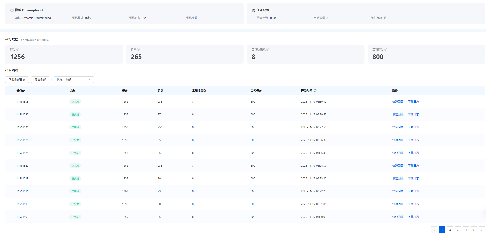

# gorge_walk

详细实验说明见[峡谷漫步开发指南](..\docs\峡谷漫步开发指南.md)。

地图如下：

4种算法选一个，或者自己 DIY。我选用动态规划，不得不说训练起来很快，迭代优化很方便，结果也很好。尤其是测评二随机环境，其他方法都不好 train，最终还是靠动态规划取巧拿到了很不错的分数。

## 关于测评

两次测评，第一次是固定环境，第二次是随机环境，参数设置：

- 第一次：最大步长 1999，10个宝箱全部生成，理论最高分为 1491.8
- 第二次：最大步长 1800，生成8个随机宝箱，理论最高分大约在 1250~1260 左右

第二次测评比第一次测评晚一两天，中途可以换模型。

最终分数取平均值。

## 关于思路

关于测评一，最开始我还是按照正常动态规划的写法来写的，即列出所有状态，设定好奖励，然后迭代优化。但是总状态数高达 $64 \times 64 \times 1024 = 4194304$，训练差不多要一个多小时，算不完；后来优化了状态空间，仅考虑可达的状态，大概一百多万个，训练时间15分钟左右，效果不错，有1470多分，不过不是最优解。后来发现完全可以采取一些取巧的手段：

首先，可以将问题建模成类似 TSP 的图论问题，即有起点+终点+宝箱生成点共12个节点，节点间均有无向边相连。我们希望找到一条从起点到终点，经过所有宝箱生成点，且总距离最短的路径。求解这个问题可以得到理论最优路径 (依次收集宝箱: `[0, 1, 2, 4, 5, 9, 8, 3, 6, 7]`，总步数 290，分数 1491.8)，然后我们强行让 agent 学会走这条路径就可以了。

于是可以将状态划分为 11 个阶段，依次是收集了 0 个宝箱、1 个宝箱、...、10 个宝箱，每个阶段都有各自的终点，即最优路径上对应的下一个宝箱生成点。这样一来，总状态数降为 $11 \times 64 \times 64 = 45056$，可以接受。最后训练时间大概 10 秒钟就训完了，非常快，评估也是顺利拿到 1491 分。

需要注意的是，这样的实现是自带**跳过阶段**的机制的，例如环境当中没有生成宝箱 1，那么 agent 收集完宝箱 0 后，可以直接跳过阶段 1，直接进入阶段 2，也就是直接去收集宝箱 2；倘若环境当中一个宝箱都没有，那么 agent 可以直接跳过前面 10 个阶段，直接进入第 11 个阶段，也就是直接到达终点。这样一来，当宝箱数量较少时，agent 可以快速跳过前面若干个阶段，少绕了很多路，同样也能取得**较优**甚至是理论**最优**的成绩，算法**鲁棒性非常优异**。理解这一点，就能明白为什么接下来测评二同样也能得到较好的成绩了。

> 附：另外一种让 agent 走固定路径的方式是，地图的 $64 \times 64 = 4096$ 个格子即为 4096 个状态，从起点出发，手动调整每个格子 (状态) 的奖励，给予正确的方向一个很大的奖励，这样 agent 就会沿着设定的路径走 (有点类似于打表)。缺点是没有跳过阶段的能力，当宝箱数量较少时，agent 需要绕很多路，分数会低很多。虽然实现起来非常简单，但是鲁棒性较差。

---

关于测评二，由于是随机环境，所以一般方法都不好做，很多人连终点都走不到。但是我们可以把测评一的模型**原封不动**地搬过来直接用，并且效果也非常优异 (均分 1250+，和理论最高分十分接近)，这也得益于算法的鲁棒性。事实上，当前的算法**无论环境当中宝箱有多少个**，均能取得**较优**甚至是**最优**的成绩，是名副其实的万金油。

