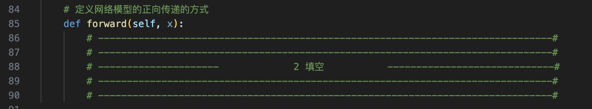
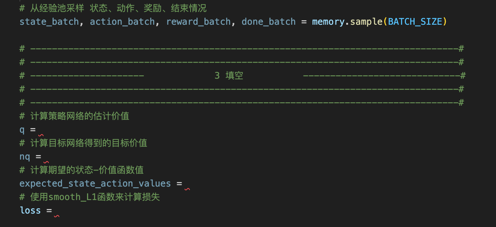

# 总共三处代码填空：
## 在dqn_for_train_atari_blank.py如下三处：
### 1、Class ActionSelector => select_action 函数

### 2、Class DQN => forward 函数

### 3、mian => optimize_model 函数


# 程序运行
```
# 进入目录
cd ./DQN/atari

# 导入ROMS
python -m atari_py.import_roms ./Atari-2600-VCS-ROM-Collection

# 安装依赖的库
pip install tqdm

#训练命令 
python dqn_for_train_atari_blank.py

#测试预训练模型   
python dqn_for_test_atari.py
```

# 运行结果记录：
将代码运行过程中```loss变化图```截图记录下来，形成**一个**```姓名+学号.pdf```，保存在当前目录下。


