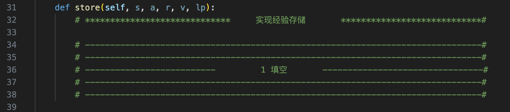
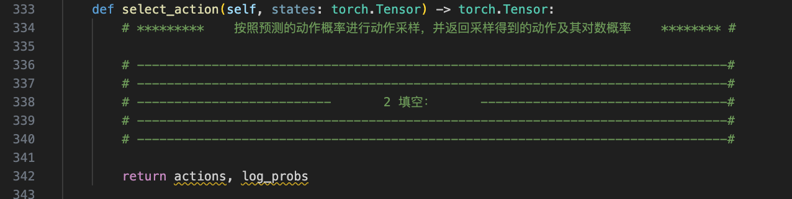
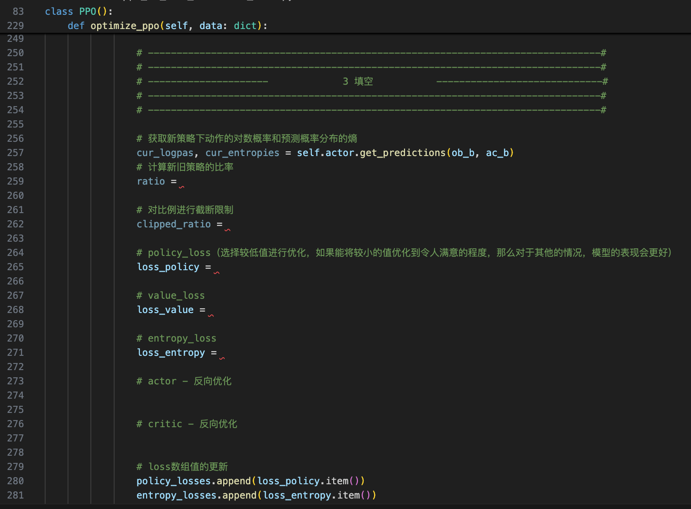

# 总共三处代码填空：
## ppo_for_train_lunarlander_blank.py如下三处：
### 1、 Class PPOMemory => store 函数

### 2、 Class Actor => select_action 函数

### 3、 Class PPO => optimize_ppo 函数


# 程序运行
```
# 进入目录
cd ./PPO/lunarlander

# 安装依赖的库
pip install tqdm

#训练命令 
ppo_for_train_lunarlander_blank.py

#测试预训练模型   
ppo_for_test_lunarlander.py
```

# 运行结果记录：
将代码运行过程中```控制台的输出```、```游戏界面```截图记录下来，形成**一个**```姓名+学号.pdf```，保存在当前目录下。


