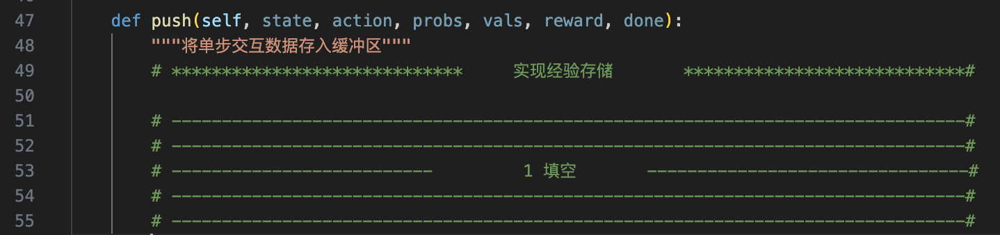
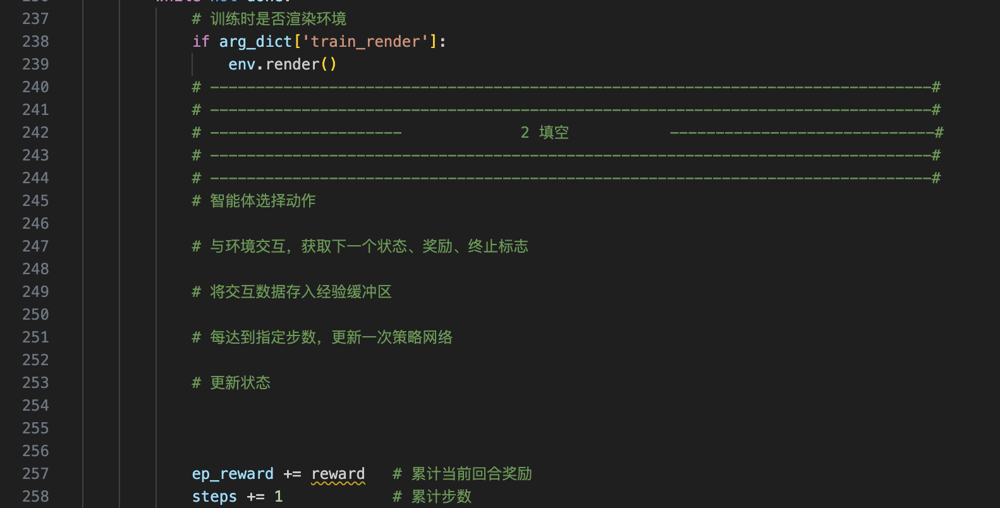
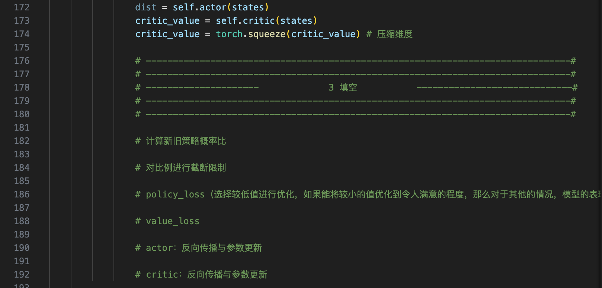

# 总共三处代码填空：
## ppo_for_train_cartpole_blank.py如下三处：
### 1、 Class PPOMemory => push 函数

### 2、 train 函数

### 3、 Class PPO => update 函数


# 程序运行
```
# 进入目录
cd ./PPO/cartpole

#运行命令 
python ppo_for_train_cartpole_blank.py


# 运行结果记录：
将代码运行过程中```控制台的输出```、```奖励变化图```,```游戏界面```截图记录下来，形成**一个**```姓名+学号.pdf```，保存在当前目录下。


